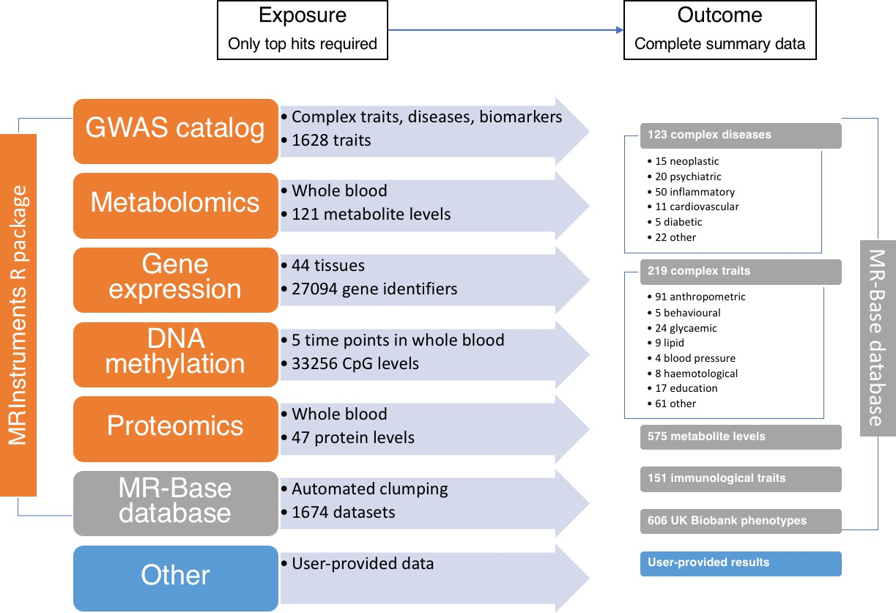

```{r, include=FALSE, cache=FALSE}
knitr::read_chunk('answers.R')
knitr::opts_chunk$set(eval = FALSE)
```


## Objectives of this session

1. Gain familiarity with various R packages for performing two-sample MR
2. Reproduce several published MR analyses
3. Use range of sensitivity analyses to aid interpretation

We will use four different analyses for illustration:

- Urate on coronary heart disease
	- IVW vs other methods
- LDL cholesterol on alzheimer's disease
	- Outlier analysis
- Bi-directional education on intelligence
	- Steiger filtering
- Lipids on coronary heart disease
	- Multivariable MR

## A note about software

In order to perform MR, you need to obtain the necessary data, put it into the format required for a particular package, and then analyse and interpret the results.

There are now several software packages available for MR analysis, for example

- [TwoSampleMR](https://github.com/MRCIEU/TwoSampleMR/) package, developed in Bristol (part of the [MR-Base](https://www.mrbase.org/) project)
- [Mendelian randomization R package](https://cran.r-project.org/package=MendelianRandomization), developed by Steve Burgess at Cambridge
- [GSMR R package](http://cnsgenomics.com/software/gsmr/) developed by Jian Yang and colleagues at University of Queensland
- [RadialMR R package](https://github.com/wspiller/radialmr) developed by Jack Bowden and Wes Spiller
- [mrrobust stata package](https://github.com/remlapmot/mrrobust), developed by Tom Palmer, Wes Spiller, Neil Davies
- several more also arising now
- For two-stage least squares analysis with individual level data use the [systemfit R package](https://cran.r-project.org/web/packages/systemfit/index.html) or ivreg in stata

For this practical we will be predominantly using the TwoSampleMR that can connect to the OpenGWAS database of GWAS summary data (https://gwas.mrcieu.ac.uk/) with functions for harmonising the data and analysing etc. It also can be used easily with several of the other packages.

You can find extended documentation on how to conduct various MR analyses here [https://mrcieu.github.io/TwoSampleMR/](https://mrcieu.github.io/TwoSampleMR/)

Sometimes the OpenGWAS servers have problems, so all the data has been pre-extracted here in case it is not available from the servers

```{r}
load("pre_extracted.rdata")
```

## Installation

If you are in a fresh environment that has not been setup for this practical, you will need to install the required packages. Do the following:

```r
install.packages(c("devtools", "psych", "dplyr", "ggplot2", "plyr"))
devtools::install_github("MRCIEU/TwoSampleMR")
```

NOTE: You don't need to do this for the practical in Posit Cloud - everything is already installed

## Basic workflow

This schematic shows the steps required to perform two-sample MR


## Data available in OpenGWAS

We want to find the effect of an exposure on an outcome. An exposure can be analysed if instruments (i.e. GWAS hits) have been identified for it. Hence the only data required are the following for the top hits: rsid, effect size, standard error, effect allele. These are often recorded in various databases such as GWAS catalog etc. To test the effect of that exposure on the outcome, we need those same SNPs' effects on the outcome. There is no guarantee that they will have previously been GWAS hits, so a trait can only generally be analysed as an outcome if it has complete GWAS summary data available.



## OpenGWAS authentication

For this practical you can use the pre-downloaded data as described above. But if you would like to use the OpenGWAS database directly, you need to authenticate at https://api.opengwas.io. These are the steps:

1. Go to https://api.opengwas.io and generate a token.
2. Create a file called `~/.Renviron` and store your token here like this:

```
OPENGWAS_JWT=eyJhbGciOiJSUzI...
```

3. Restart your R session. You should be able to run `ieugwasr::get_opengwas_jwt()` and it should print out your access token.


---

## Exercises

### 1. The influence of urate levels in blood on coronary heart disease

This was the subject of an analysis by [White et al 2016][1]. First we need to obtain instruments for urate levels. A quick way to do this is to see if a suitably powered urate GWAS is available in OpenGWAS, and extract the LD-clumped top hits


```{r}
library(TwoSampleMR)
# ao <- available_outcomes()
subset(ao, grepl("Urate", trait))
```

The first result is the Kottgen et al 2013 GWAS using 110347 individuals. We can extract the top hits from this study

```{r}
# exposure_1 <- extract_instruments(outcomes = 1055)
head(exposure_1)
```

```{r}
dim(exposure_1)
```

```{r}
max(exposure_1$pval.exposure)
```

We have extracted 27 instruments for urate levels from this study. These have been automatically clumped so that they represent independent signals for urate levels. The columns represent the summary statistics for this trait - crucially they include the effect size and standard error, and also the effect allele. 

Next we need to get the corresponding effects from a suitably powered coronary heart disease study

```{r}
subset(ao, grepl("Coronary", trait))
```

The Nikpay et al 2015 study is very large (60801 cases), and is a genome-wide study with good imputation (9455779 SNPs)

```{r}
# outcome_1 <- extract_outcome_data(snps = exposure_1$SNP, outcome = 7)
head(outcome_1)
```

```{r}
dim(outcome_1)
```

We have now extracted those `r nrow(exposure_1)` SNPs from the Nikpay et al GWAS into the `outcome_1` data frame.

Next we have to harmonise the exposure and outcome data - meaning that the effect estimates are always on the same allele. 

```{r}
merge(
	subset(exposure_1, select=c(SNP, effect_allele.exposure)),
	subset(outcome_1, select=c(SNP, effect_allele.outcome))
)
```
Eyeballing this we can see that the effect alleles are actually always the same in the two studies, because in the OpenGWAS database everything is aligned to have the non-effect allele to be the hg19 reference allele. But in practice it is important to always check and to perform the harmonisation.

Harmonisation will attempt to match the SNPs in exposure and outcome based on
- SNP name (e.g. rsID)
- effect and non-effect alleles - the function below attempts to align the two studies by seeing if switching the effect allele will match the alleles across studies, or switching the strand. It will use allele frequencies to try to harmonise palindromic SNPs.
- whether or not you assume everything is on the forward strand. By default it does NOT assume forward strand, and therefore it can drop palindromic SNPs if the frequencies are relatively intermediate. If you are confident that your data is on the forward strand (i.e. relatively recent imputed data) then you can provide an argument `action=3` that will avoid dropping such palindromic SNPs

```{r}
dat_1 <- harmonise_data(exposure_1, outcome_1)
```

```{r}
dim(dat_1)
```

```{r}
table(dat_1$mr_keep)
```

**DISCUSS: What has happened here - why are only 25 SNPs being retained for MR analysis?**


```{r, answers1, results='asis', eval=rmarkdown::metadata$answers, echo=FALSE}

```

```{r, answers2, eval=rmarkdown::metadata$answers, echo=FALSE}

```

We can now perform MR analysis on this harmonised dataset using the IVW method

```{r}
res_1 <- mr(dat_1, method_list="mr_ivw")
str(res_1)
```

So what we see here is the MR result that aggregates the causal estimate from each of the 25 SNPs into a single overall analysis. It does this using a fixed effects meta analysis of the estimates for each of the 25 SNPs (or inverse variance weighted analysis). 

Is there evidence for heterogeneity?

```{r}
mr_heterogeneity(dat_1, method_list="mr_ivw")
```

The Q statistic is much larger than the number of degrees of freedom. It looks like there is substantial heterogeneity. Let's plot the results

```{r}
mr_scatter_plot(res_1, dat_1)
```

```{r}
mr_forest_plot(mr_singlesnp(dat_1, all_method="mr_ivw"))
```

We can try running a few sensitivity analyses

```{r}
sens_1 <- mr(dat_1, method_list=c("mr_ivw", "mr_weighted_median", "mr_egger_regression", "mr_weighted_mode"))
sens_1
```

Each of these methods aggregates the 25 SNPs in a different way

- `mr_ivw` - the weighted mean estimate, giving more weight to those with smaller standard error. This assumes that if there is any horizontal pleiotropy at the 25 SNPs, on average it balances out (e.g. the bias from SNP 1 is +0.5, the bias from SNP 2 is -0.5, so the overall bias is 0)
- `mr_weighted_median` - the median estimate, giving more weight to those with smaller standard errors. This assumes that at least 50% of the SNPs have balanced pleiotropy
- `mr_egger_regression` - attempts to model any deviation from balanced pleiotropy. The intercept is estimated to represent the average directional pleiotropy. The other estimates constrain the slope to go through the origin. 
- `mr_weighted mode` - density-based clustering is used to identify the largest group of SNPs that provide a similar causal effect estimate.

```{r}
mr_scatter_plot(sens_1, dat_1)
```

**DISCUSS: How do we interpret the results now?**

```{r, answers3, results='asis', eval=rmarkdown::metadata$answers, echo=FALSE}

```


---

### 2. LDL cholesterol on Alzheimer's disease

We use this example to illustrate how outliers can make big influences on IVW analysis. Outliers here means, if you have a number of SNPs that can be used to give estimates of the causal effect, perhaps some of these estimates are substantially different from all of the others. One explanation for this is horizontal pleiotropy - the SNP is influencing the outcome directly on the outcome, not just through the exposure.

```{r}

# The study ID for LDL cholesterol in the GLGC GWAS is 300
# exposure_2 <- extract_instruments(300)

# Extract those SNPs from the IGAP Alzheimer's disease study (2013)
# outcome_2 <- extract_outcome_data(exposure_2$SNP, 297)

# Harmonise
dat_2 <- harmonise_data(exposure_2, outcome_2)

res_2 <- mr(dat_2)
mr_scatter_plot(res_2, dat_2)

```

We can use the RadialMR R package to detect SNP outliers in MR. 

```{r}
library(RadialMR)
dat_2_radial <- format_radial(BXG = dat_2$beta.exposure, BYG = dat_2$beta.outcome, seBXG = dat_2$se.exposure, seBYG = dat_2$se.outcome, RSID=dat_2$SNP)

ivwradial_2 <- ivw_radial(dat_2_radial, weights=1)
ivwradial_2$outliers
```

Remove the outliers and re-analyse

```{r}
res_2_o <- mr(subset(dat_2, !SNP %in% ivwradial_2$outliers$SNP))
res_2
```

```{r}
res_2_o
```

```{r}
mr_scatter_plot(res_2_o, subset(dat_2, !SNP %in% ivwradial_2$outliers$SNP))
```

**DISCUSS: How do the results compare before and after outlier removal?**

```{r, answers4, results='asis', eval=rmarkdown::metadata$answers, echo=FALSE}

```

**DISCUSS: What could bias the results aside from pleiotropy etc?**

```{r, answers5, results='asis', eval=rmarkdown::metadata$answers, echo=FALSE}

```

---

### 3. Education and intelligence

Much debate over the extent to which education influences intelligence and vice versa. The following two exercises reproduce (using slightly older data) the analyses performed by [Anderson et al 2018][2]. We can perform a bi-directional MR analysis, where we estimate the effects of education on intelligence, and then separately the effect of intelligence on education.

The MR-Base IDs for educational attainment and intelligence are `1001` and `UKB-a:196`, respectively

First do MR of education on intelligence

```{r}
# exposure_3a <- extract_instruments(1001)
# outcome_3a <- extract_outcome_data(exposure_3a$SNP, "UKB-a:196")
dat_3a <- harmonise_data(exposure_3a, outcome_3a)
mr(dat_3a)
```

Now do the reverse, intelligence on education:

```{r}
# exposure_3b <- extract_instruments("UKB-a:196")
# outcome_3b <- extract_outcome_data(exposure_3b$SNP, 1001)
dat_3b <- harmonise_data(exposure_3b, outcome_3b)
mr(dat_3b)
```

There are clearly very large effects in both directions. However, suppose that education is influeced by intelligence, and all the education instruments are actually just intelligence instruments - isn't a strong education-intelligence association exactly as we would expect? i.e. because we already know that the 'education SNPs' will have big effects on intelligence.

We can test the extent to which these SNPs are likely to be influencing education first and intelligence second, or vice versa. We do this by comparing the variance explained by the SNPs in the exposure against the outcome. We expect valid instruments to explain more variance in the exposure than the outcome. This method is known as Steiger filtering.

```{r}
dat_3a$units.outcome <- "SD"
dat_3a <- steiger_filtering(dat_3a)
dat_3b$units.exposure <- "SD"
dat_3b <- steiger_filtering(dat_3b)
```

```{r}
# How many education SNPs influence education first
table(dat_3a$steiger_dir)
```

```{r}
# How many intelligence SNPs influence intelligence first
table(dat_3b$steiger_dir)
```

Let's re-estimate the education-intelligence association, excluding SNPs that appear to influence intelligence first

```{r}
mr(dat_3a)
```

```{r}
mr(subset(dat_3a, steiger_dir))
```

**DISCUSS: How has Steiger filtering impacted the relationship?**

```{r, answers6, results='asis', eval=rmarkdown::metadata$answers, echo=FALSE}

```


---

### 4. Multivariable analysis of LDL, HDL and triglycerides on CHD

A major motivator for MR is to identify traits that we can intervene on for beneficial outcomes. The genetic influences on lipids are shared amongst the various subtypes, so it is difficult to gauge the specificity of the result from an MR analysis.

We can improve on single MR analyses by perform multivariable MR analysis, estimating the joint influences of several lipid traits on risk of coronary heart disease [Burgess and Thompson 2015][3].

We will analyse LDL cholesterol (`ieu-a-300`), HDL cholesterol (`ieu-a-299`) and triglycerides (`ieu-a-302`) on CHD (`ieu-a-7`)

First let's look at the univariate analyses

```{r}
# exposure_4a <- extract_instruments("ieu-a-299")
# outcome_4a <- extract_outcome_data(exposure_4a$SNP, "ieu-a-7")
dat_4a <- harmonise_data(exposure_4a, outcome_4a)

# exposure_4b <- extract_instruments("ieu-a-300")
# outcome_4b <- extract_outcome_data(exposure_4b$SNP, "ieu-a-7")
dat_4b <- harmonise_data(exposure_4b, outcome_4b)

# exposure_4c <- extract_instruments("ieu-a-302")
# outcome_4c <- extract_outcome_data(exposure_4c$SNP, "ieu-a-7")
dat_4c <- harmonise_data(exposure_4c, outcome_4c)

mr(dat_4a)
```

```{r}
mr(dat_4b)
```

```{r}
mr(dat_4c)
```

Higher LDL has a large effect on higher risk, but higher HDL looks like it might protect, and higher triglycerides might have higher risk. Let's see what multivariable analysis suggests

```{r}
# exposure_4d <- mv_extract_exposures(c("ieu-a-299","ieu-a-300","ieu-a-302"))
# outcome_4d <- extract_outcome_data(exposure_4d$SNP, "ieu-a-7")
dat_4d <- mv_harmonise_data(exposure_4d, outcome_4d)
mv_multiple(dat_4d)
```

**DISCUSS: How would you interpret the influence HDL cholesterol now?**

```{r, answers7, results='asis', eval=rmarkdown::metadata$answers, echo=FALSE}

```

---

[1]: https://www.thelancet.com/journals/landia/article/PIIS2213-8587(15)00386-1/abstract "White et al. Plasma urate concentration and risk of coronary heart disease: a Mendelian randomisation analysis. Lancet Diabetes Endocrinol. 2016 Apr;4(4):327-36"
[2]: https://www.biorxiv.org/content/early/2018/08/27/401042 "Anderson et al. Education, intelligence and Alzheimer's disease: Evidence from a multivariable two-sample Mendelian randomization study. Biorxiv 2018 https://doi.org/10.1101/401042"
[3]: https://academic.oup.com/aje/article/181/4/251/121453 "Multivariable Mendelian Randomization: The Use of Pleiotropic Genetic Variants to Estimate Causal Effects. American Journal of Epidemiology, Volume 181, Issue 4, 15 February 2015, Pages 251–260"

<!-- save(exposure_1, exposure_2, exposure_3a, exposure_3b, exposure_4a, exposure_4b, exposure_4c, exposure_4d, outcome_1, outcome_2, outcome_3a, outcome_3b, outcome_4a, outcome_4b, outcome_4c, outcome_4d, file="pre_extracted.rdata")
 -->


